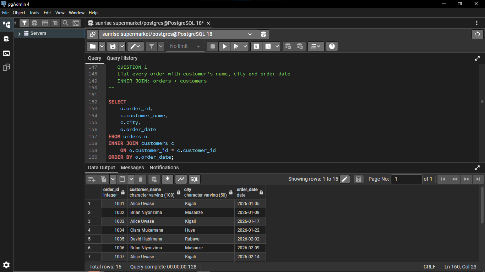
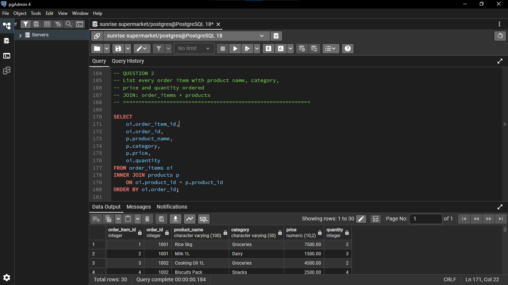
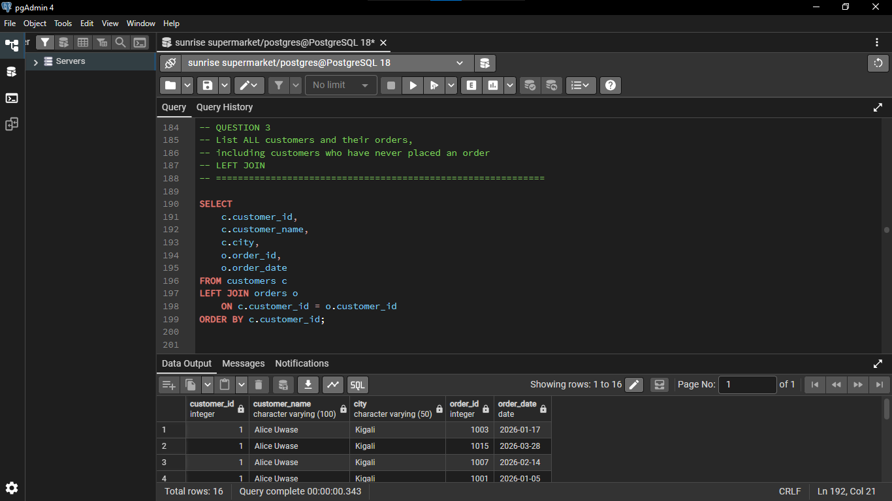
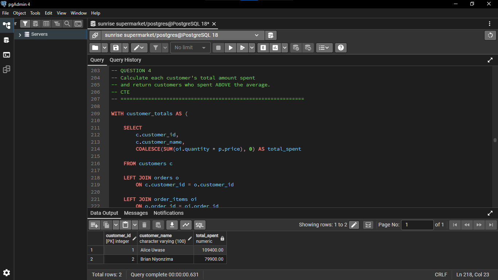
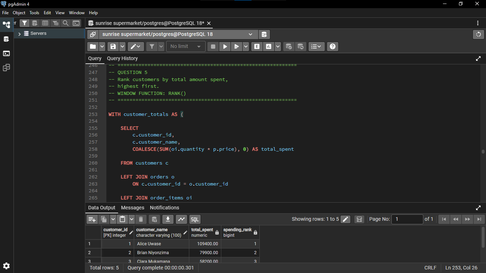
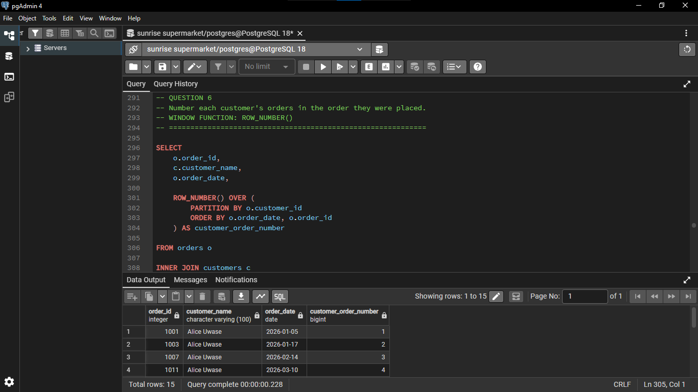
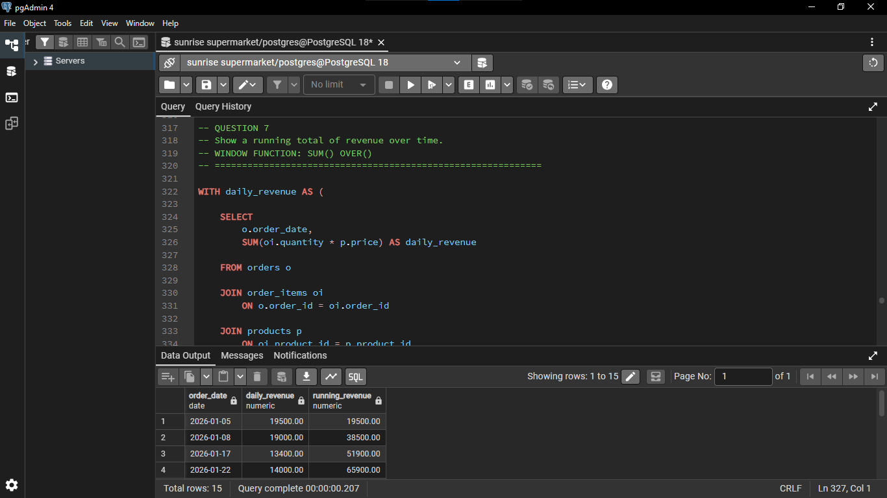
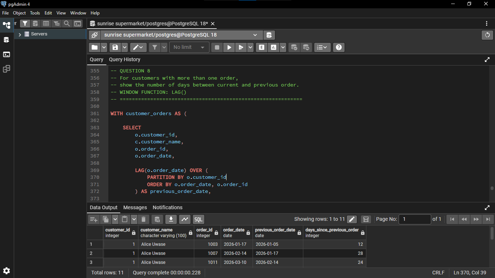

# Sunrise Supermarket — PL/SQL Assignment One
## Student Information

**Student Name:** TUYISENGE Kevin
**Student ID:** 20252SEN346
**DBMS Used:** PostgreSQL

**Repository Name:** assignment_1_tuyisengekevin-20252SEN346

---

## 1. Business Scenario

Sunrise Supermarket sells products to customers. Customers place orders containing one or more items.

The management of Sunrise Supermarket wants to understand:

* Who their customers are
* What products customers buy
* How much customers spend
* How frequently customers place orders
* How sales revenue changes over time

To answer these questions, the database contains four tables:

* `customers`
* `products`
* `orders`
* `order_items`

The assignment requires at least 5 customers, 8 products across at least 3 categories, 15 orders, and 25 order items distributed across multiple dates.

---

# 2. Database Tables

## Customers

The `customers` table stores information about supermarket customers.

```text
customer_id
customer_name
email
city
```

`customer_id` is the primary key.

---

## Products

The `products` table stores information about products sold by Sunrise Supermarket.

```text
product_id
product_name
category
price
```

`product_id` is the primary key.

---

## Orders

The `orders` table stores information about customer orders.

```text
order_id
customer_id
order_date
```

`order_id` is the primary key, while `customer_id` is a foreign key referencing the `customers` table.

---

## Order Items

The `order_items` table stores the products included in each order.

```text
order_item_id
order_id
product_id
quantity
```

`order_item_id` is the primary key.

`order_id` references the `orders` table.

`product_id` references the `products` table.

---

# 3. Data Inserted

The database contains:

* **5 customers**
* **8 products**
* **4 categories**
* **15 orders**
* **25 order items**
* Orders distributed across January, February and March 2026

The four product categories are:

1. Groceries
2. Dairy
3. Household
4. Snacks

---

# 4. Question 1 — INNER JOIN

## Requirement

List every order with the customer's name, city and order date.

## Query

```sql
SELECT
    o.order_id,
    c.customer_name,
    c.city,
    o.order_date
FROM orders o
INNER JOIN customers c
    ON o.customer_id = c.customer_id
ORDER BY o.order_date;
```

## Explanation

An `INNER JOIN` connects the `orders` table with the `customers` table using `customer_id`.

It returns orders that have a matching customer.

## Business Interpretation

This helps management know:

* Which customer placed an order
* Where the customer is located
* When the order was placed

### Result Screenshot


---

# 5. Question 2 — JOIN

## Requirement

List every order item with the product name, category, price and quantity ordered.

## Query

```sql
SELECT
    oi.order_item_id,
    oi.order_id,
    p.product_name,
    p.category,
    p.price,
    oi.quantity
FROM order_items oi
INNER JOIN products p
    ON oi.product_id = p.product_id
ORDER BY oi.order_id;
```

## Explanation

The `order_items` table contains the product ID, but not the product's name or price.

The JOIN connects `order_items` to `products` using `product_id`.

## Business Interpretation

This allows management to see the products purchased and the quantity ordered.

### Result Screenshot



---

# 6. Question 3 — LEFT JOIN

## Requirement

List all customers and their orders, including customers who have never placed an order.

## Query

```sql
SELECT
    c.customer_id,
    c.customer_name,
    c.city,
    o.order_id,
    o.order_date
FROM customers c
LEFT JOIN orders o
    ON c.customer_id = o.customer_id
ORDER BY c.customer_id;
```

## Explanation

A `LEFT JOIN` returns every customer from the `customers` table.

If a customer has no order, the order columns will contain `NULL`.

## Business Interpretation

This allows management to identify customers who have registered but have not purchased anything.

### Result Screenshot



---

# 7. Question 4 — CTE

## Requirement

Calculate each customer's total amount spent and return only customers who have spent above the average customer spend.

## Query

```sql
WITH customer_totals AS (

    SELECT
        c.customer_id,
        c.customer_name,
        COALESCE(SUM(oi.quantity * p.price), 0) AS total_spent

    FROM customers c

    LEFT JOIN orders o
        ON c.customer_id = o.customer_id

    LEFT JOIN order_items oi
        ON o.order_id = oi.order_id

    LEFT JOIN products p
        ON oi.product_id = p.product_id

    GROUP BY
        c.customer_id,
        c.customer_name
)

SELECT
    customer_id,
    customer_name,
    total_spent

FROM customer_totals

WHERE total_spent >
      (SELECT AVG(total_spent)
       FROM customer_totals)

ORDER BY total_spent DESC;
```

## Explanation

A **CTE (Common Table Expression)** is created using the `WITH` keyword.

The CTE calculates the total amount spent by every customer.

The formula used is:

```text
quantity × price
```

The `SUM()` function adds the amounts for each customer.

The main query then calculates the average customer spending and returns only customers whose spending is greater than that average.

## Business Interpretation

Management can identify customers who spend more than the average customer.

### Result Screenshot



---

# 8. Question 5 — RANK()

## Requirement

Rank customers by total amount spent, highest first.

## Query

```sql
WITH customer_totals AS (

    SELECT
        c.customer_id,
        c.customer_name,
        COALESCE(SUM(oi.quantity * p.price), 0) AS total_spent

    FROM customers c

    LEFT JOIN orders o
        ON c.customer_id = o.customer_id

    LEFT JOIN order_items oi
        ON o.order_id = oi.order_id

    LEFT JOIN products p
        ON oi.product_id = p.product_id

    GROUP BY
        c.customer_id,
        c.customer_name
)

SELECT
    customer_id,
    customer_name,
    total_spent,

    RANK() OVER (
        ORDER BY total_spent DESC
    ) AS spending_rank

FROM customer_totals

ORDER BY spending_rank;
```

## Explanation

`RANK()` is a window function.

It assigns a ranking to customers based on their total spending.

The customer with the highest spending receives rank 1.

## Business Interpretation

Management can compare customer spending and identify customers with higher purchase values.

### Result Screenshot


---

# 9. Question 6 — ROW_NUMBER()

## Requirement

Number each customer's orders in the order they were placed.

## Query

```sql
SELECT
    o.order_id,
    c.customer_name,
    o.order_date,

    ROW_NUMBER() OVER (
        PARTITION BY o.customer_id
        ORDER BY o.order_date, o.order_id
    ) AS customer_order_number

FROM orders o

INNER JOIN customers c
    ON o.customer_id = c.customer_id

ORDER BY
    c.customer_name,
    customer_order_number;
```

## Explanation

`ROW_NUMBER()` gives each order a sequential number.

`PARTITION BY customer_id` means that the numbering starts again for every customer.

For example:

```text
Customer A
Order 1 → 1
Order 2 → 2
Order 3 → 3
```

## Business Interpretation

Management can see the sequence of purchases made by each customer.

### Result Screenshot



---

# 10. Question 7 — Running Total

## Requirement

Show a running total of revenue over time, ordered by order date.

## Query

```sql
WITH daily_revenue AS (

    SELECT
        o.order_date,
        SUM(oi.quantity * p.price) AS daily_revenue

    FROM orders o

    JOIN order_items oi
        ON o.order_id = oi.order_id

    JOIN products p
        ON oi.product_id = p.product_id

    GROUP BY o.order_date
)

SELECT
    order_date,
    daily_revenue,

    SUM(daily_revenue) OVER (
        ORDER BY order_date
        ROWS BETWEEN UNBOUNDED PRECEDING
        AND CURRENT ROW
    ) AS running_revenue

FROM daily_revenue

ORDER BY order_date;
```

## Explanation

First, the CTE calculates the revenue for each date.

Then:

```sql
SUM(daily_revenue) OVER (...)
```

calculates the cumulative revenue.

For example:

```text
Day 1 → 10,000
Day 2 → 15,000
Day 3 → 20,000

Running total:
Day 1 → 10,000
Day 2 → 25,000
Day 3 → 45,000
```

## Business Interpretation

Management can see how total revenue accumulates over time and observe sales trends.

### Result Screenshot



---

# 11. Question 8 — LAG()

## Requirement

For each customer with more than one order, show how many days passed between their current and previous order.

## Query

```sql
WITH customer_orders AS (

    SELECT
        o.customer_id,
        c.customer_name,
        o.order_id,
        o.order_date,

        LAG(o.order_date) OVER (
            PARTITION BY o.customer_id
            ORDER BY o.order_date, o.order_id
        ) AS previous_order_date,

        COUNT(*) OVER (
            PARTITION BY o.customer_id
        ) AS order_count

    FROM orders o

    JOIN customers c
        ON o.customer_id = c.customer_id
)

SELECT
    customer_id,
    customer_name,
    order_id,
    order_date,
    previous_order_date,

    order_date - previous_order_date
        AS days_since_previous_order

FROM customer_orders

WHERE order_count > 1
AND previous_order_date IS NOT NULL

ORDER BY
    customer_id,
    order_date;
```

## Explanation

`LAG()` gets the previous order date for the same customer.

For example:

```text
Previous order: 2026-01-05
Current order:  2026-01-17

Days between orders = 12
```

`PARTITION BY customer_id` ensures that each customer is compared only with their own previous order.

## Business Interpretation

Management can understand how frequently repeat customers return to the supermarket.

### Result Screenshot


---

# 12. SQL Concepts Used

| Concept      | Purpose                                         |
| ------------ | ----------------------------------------------- |
| INNER JOIN   | Connect matching records between tables         |
| LEFT JOIN    | Keep all records from the left table            |
| CTE          | Create a temporary named query result           |
| RANK()       | Rank customers according to spending            |
| ROW_NUMBER() | Number orders sequentially                      |
| SUM() OVER() | Calculate a running total                       |
| LAG()        | Access the previous row's value                 |
| PARTITION BY | Divide window-function calculations into groups |
| GROUP BY     | Group rows for aggregate calculations           |
| AVG()        | Calculate an average                            |
| COALESCE()   | Replace NULL with another value                 |

---

# 13. Business Interpretation

The queries provide useful information for Sunrise Supermarket management.

### Customers

The JOIN queries connect customers with their orders and locations.

### Customer spending

The CTE identifies customers whose spending is above the average.

### Customer ranking

The `RANK()` function allows management to compare customers according to their total spending.

### Customer ordering behavior

`ROW_NUMBER()` shows the order sequence for each customer.

### Sales trends

The running revenue calculation shows how revenue accumulates over time.

### Customer frequency

`LAG()` shows the number of days between repeat orders.

Overall, the database queries help management understand customer purchasing behavior and sales patterns.

---

# 14. Challenges Encountered

## Challenge 1 — Joining multiple tables

The database uses relationships between customers, orders, order items and products.

### Solution

I used the primary and foreign keys to connect the tables:

```text
customers.customer_id
        ↓
orders.customer_id

orders.order_id
        ↓
order_items.order_id

products.product_id
        ↓
order_items.product_id
```

---

## Challenge 2 — Calculating customer spending

Customer spending requires both quantity and product price.

### Solution

I used:

```sql
quantity * price
```

and then:

```sql
SUM(quantity * price)
```

to calculate the total amount spent.

---

## Challenge 3 — Finding customers above average

The query needed to calculate individual customer totals before calculating the average.

### Solution

I used a CTE to calculate customer totals first.

---

## Challenge 4 — Understanding window functions

Window functions were used for ranking, numbering, running totals and previous-order calculations.

### Solution

I used:

```text
RANK()
ROW_NUMBER()
SUM() OVER()
LAG()
```

with `PARTITION BY` and `ORDER BY` where required.

---
# 15. How to Run

1. Install and open PostgreSQL and pgAdmin 4.
2. Create a PostgreSQL database.
3. Open the `assignment1.sql` file in pgAdmin 4.
4. Run the table creation statements.
5. Run the INSERT statements to populate the tables.
6. Execute each question query separately to view the results.
7. The screenshots in this README show the results of each query.

**DBMS:** PostgreSQL
